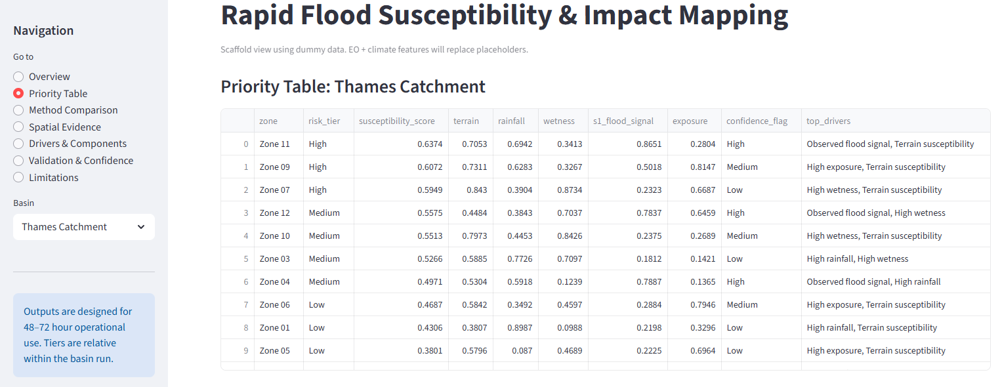
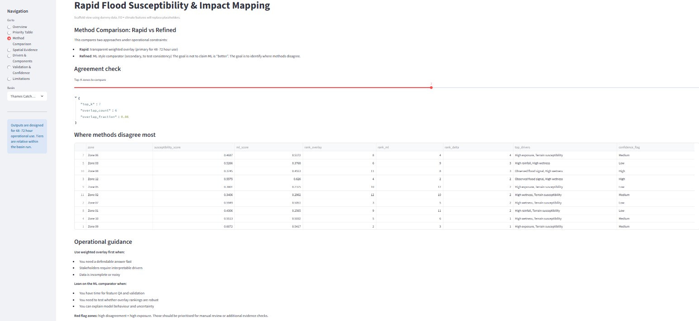

# Rapid Flood Susceptibility & Impact  
### Executive Brief (Operational Decision Support)

## What this analysis does
This analysis provides **rapid, defensible flood susceptibility and impact insights**
under realistic emergency-response constraints (48–72 hours).

It is designed to support:
- Early prioritisation of at-risk zones
- Allocation of limited response resources
- Rapid briefings to operational and policy teams

---

## How to read the results
- Start with the **Priority Table** to identify high-susceptibility zones.
- Use **Method Comparison** to understand where fast, interpretable methods agree or disagree with more complex alternatives.
- Treat outputs as **screening tools**, not detailed hydrological models.

---

## Priority overview

---

## Method comparison: speed vs accuracy

This comparison highlights where:
- Simple, transparent methods are sufficient
- Rankings are robust across approaches
- Disagreement flags areas needing manual review or additional data

---

## Operational guidance
**Use rapid weighted overlay when:**
- Time is constrained
- Data completeness is uncertain
- Interpretability is essential

**Use refined methods when:**
- There is time for validation
- Feature quality is assured
- Model behaviour can be explained clearly

---

## What this analysis does not claim
- It does not predict flood depths or extents precisely
- It does not replace hydraulic or regulatory models
- It does not remove the need for expert judgment