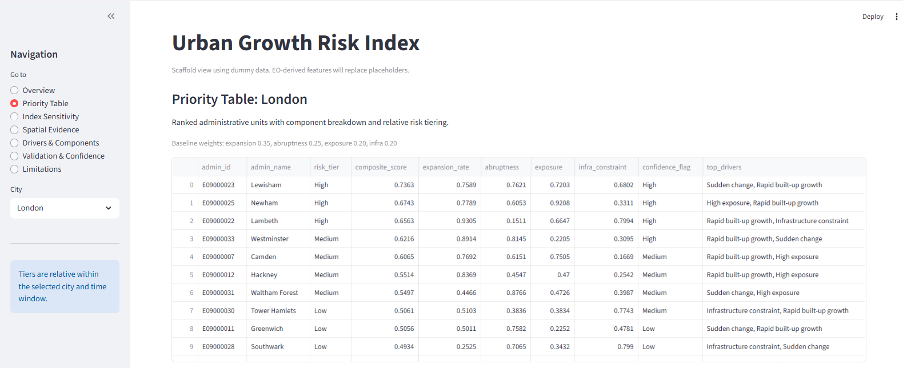
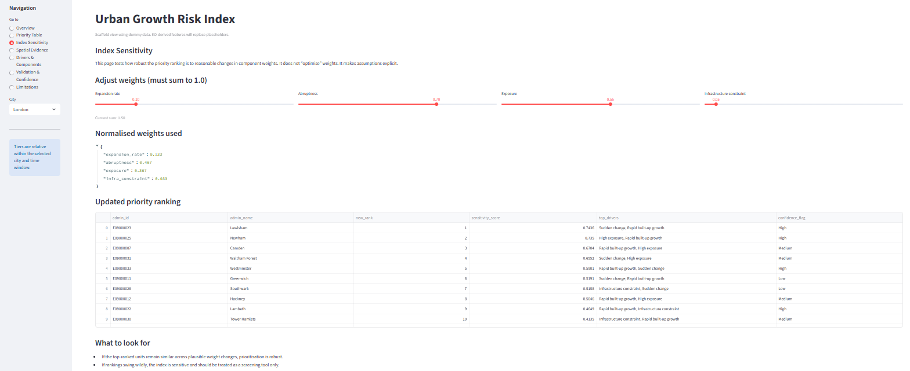

# Urban Growth Risk Assessment  
### Executive Brief (Decision Support)

## What this analysis does
This analysis identifies administrative areas where **recent urban growth patterns** may be creating planning, infrastructure, or service-delivery pressure.

It prioritises areas based on:
- Speed of built-up expansion
- Abruptness of recent change
- Exposure of population or assets
- Proximity to infrastructure constraints

The output is designed for **triage and prioritisation**, not enforcement or legal determination.

---

## How to read the results
- Start with the **Priority Table** to see which areas warrant attention first.
- Use the **Index Sensitivity** view to understand how robust the ranking is to reasonable changes in assumptions.
- Treat rankings as **relative within the city and time window**.

---

## Priority overview

---

## Assumptions and sensitivity

This view shows how rankings change when component weights are adjusted.
Stable top-ranked areas indicate robust prioritisation.
Large rank swings indicate higher uncertainty and the need for additional evidence.

---

## What this analysis does not claim
- It does not predict future growth.
- It does not identify informal settlements definitively.
- It does not replace statutory planning or field inspection.

---

## How this would be used in practice
- Target follow-up analysis and site visits
- Prioritise infrastructure or drainage reviews
- Support early-stage planning discussions under time constraints